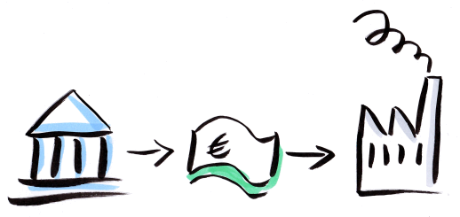

title=A Fool with a Tool is still a Fool...
date=2015-7-12
type=post
tags=
status=published
author=rdmueller
~~~~~~

...but sometimes the tool makes a difference! 

I just came back from an interesting 3 day workshop on which I had a first 
chance to make use of my drawing equipment I bought recently. Originally, I wanted to draw some slides for my talk at 
[Entwicklertag Karlsruhe](https://rdmueller.github.io/etka/) but we later dropped the idea in favour of professional clip art.

But since we've had a flip chart available at the workshop and I thought that creating power point slides would take too much
time when only 3 days are available, I gave it a try:

Diese Abbildung wurde inspiriert durch die bikablo® Publikationen, www.kommunikationslotsen.de

I used my [neuland "fine One" set of artmarkers](http://de.neuland.com/marker-und-stifte/neuland-marker/fineone-by-neuland-artmarker-pinselpitze-13er-farbset.html?c=725) 
and my [bikablo-books](http://bikablo.kommunikationslotsen.de/bikablo-produkte/) with lot's of ideas on how to visualize ideas and then started to draw. The feedback I've got was great!

The "fine One" markers are not the best for a flip chart - they are designed for smaller format, but the do work on larger formats too.
The brush tip gives your drawings a professional look which is visibly different from standard flip chart markers. The different light colors enable you to colorize your visualisations and give them the finishing touch.

Btw: after I had my first results with the artmarkers, I bought myself a Wacom Intuos drawing tablet ([CTH-480](http://www.wacom.com/en-gb/products/pen-tablets/intuos-pen-and-touch-small)) and searched for good and affordable drawing software to recrate the effects I created with the artmakers. I found [InkScape](https://inkscape.org/) to be the most convenient and free tool. This is the result:

Diese Abbildung wurde inspiriert durch die bikablo® Publikationen, www.kommunikationslotsen.de

If you have any hints on how to get better results (I guess there is better software :-) please tell me!
