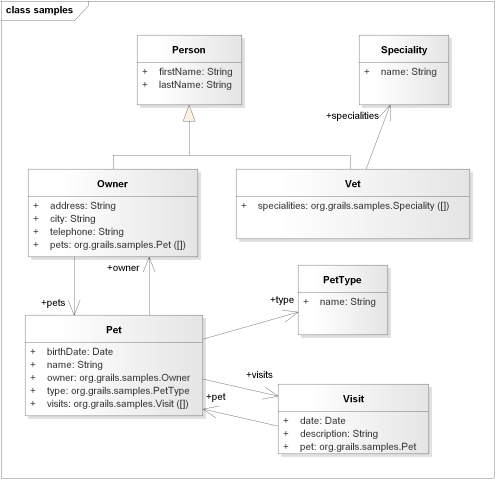

title=Domain Class Diagrams for Grails Projects
date=2015-8-14
type=post
tags=grails
status=published
author=rdmueller
~~~~~~

A Grails project can quickly grow into larger applications. In order to still keep an overview, some architecture documentation is quite useful. One of the most useful diagrams to dive into an application is the domain class diagrams which shows you how your business or domain object interact.

There are a lot of tools on the market which let you analyze and reverse engineer your project in order to draw such a class diagram. They fall in two categories:

- Tools which automatically create and layout your diagram
- Tools which let you manually enhance the diagram after discovering your classes

For the first category, there are some Grails plugins which use tools like PlantUML to draw the needed diagrams right from within the Grails framework. That's great to get a quick overview, but since you can't easily enhance the diagrams with additional information or lay out the elements with your wisdom, I don't like them to create my project documentation.

There are great tools within the second categroy, but unfortunately, I am not aware of a single one which is capable of doing the trick for Groovy classes - only Java ones. Some of them are highly configurable and it would be possible to teach them how to work with Groovy. But the effort to do so is high. For Enterprise Architect by Sparx Systems, you need Groovy descirbe as EBNF - I am currently not aware of an EBNF description and it would be hard to create and maintain one by myself.

So what to do? Groovy already looks like Java and Grails knows about its domain classes. So my approach is to use a script which takes the knowledge about the domain classes available within grails and creates Java classes from it.

These classes then can be easily fed into whatever UML tool you chose. As Result, you will have

- an easy way to export and synchronize your Grails domain classes to any UML tool capable of analyzing Java sources
- depending on you Tool, you are free to manually add your knowledge and lay out the diagrams as you like
- most tools keep your manual layout and additions even when you re-synchronize the diagrams with your code

## Details of the Solution ##

As already mentioned, I use the information already available in Grails. In order to do so, I wrote a Grails script which is invoked from the command line. The following Gist shows you the code.

Unfortunately, Grails only knows about the code, not the comments which are available within the source. So I added a little dirty hack which fetches the source of the domain class and extracts the first comment - hopefully the description of the domain class - and adds it to the java sources.

In order to make it even more convenient, you can check out your UML-Tool and see if it let's you automate the synchronisation with your generated code.

## Example ##

Here is an example diagram for the [Grails PetClinic sample application](https://github.com/grails-samples/grails-petclinic) created with [Enterprise Architect](http://sparxsystems.com/).

