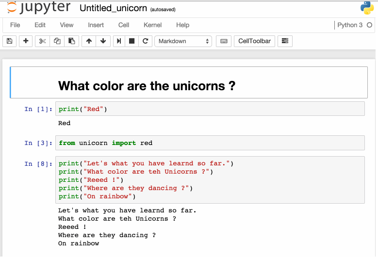

title=A Groovy Notebook
date=2016-4-30
type=post
tags=groovy, asciidoc
status=published
author=rdmueller
~~~~~~

From time to time I stumble upon a web application which lets you write notebooks like the ones you know from Mathematica. They let you mix formatted text which explains your code with code snippets. The output of those snippets is displayed and the code builds up snippet by snippet.

Taken from the <a href="http://blog.jupyter.org/2016/01/08/notebook-4-1-release/">Jypter Blog</a>

This time it was [Jypiter](http://jupyter.org/), formerly known as [IPython Notebook](http://ipython.org/notebook.html). It evolved from a notebook just for Python to a cool solution suitable for all kind of languages. Unfortunately, Groovy isn't yet in the list of supported languages.

Since Python is not my mother tongue and I couldn't find good documentation on how to support an additional language, I thought about other ways to create a notebook for Groovy.

Inspired by the talk ["Make your Asciidoctor Groovy"](http://greachconf.com/speakers/stephan-classen-make-your-asciidoctor-groovy/) by Stephan Classen (which I unfortunately haven't attended), I decided to create an asciidoctorj plugin in Groovy which lets you execute Groovy code inline.

There are already great examples of plugins written in Groovy, so I had a good starting point:

* Stephan Classen: [asciidoctorj-screenshot](https://github.com/asciidoctor/asciidoctorj-screenshot)
* mrhaki: [Awesome Asciidoctor: Write Extensions Using Groovy (or Java)](http://mrhaki.blogspot.de/2014/08/awesome-asciidoc-write-extensions-using.html)
* Andreas Almiray: [Gradle Glam: custom asciidoctor extensions](http://www.jroller.com/aalmiray/entry/gradle_glam_custom_asciidoctor_extensions)

So I took one of them as starting point and came up with [my own project](https://github.com/rdmueller/asciidoctorj-groovy). The core of the extension is shown here:

It is activated whenever asciidoctor hits a `[groovy]` block. It then takes the content of the block, executes it and renders the original script together with the output. Infortunately, I couldn't find a way to return two different blocks in my extension - one which renders the source with highlighting and one which renders the pre-formatted output - so I had to do an ugly workaround which directly renders HTML. Do the simplest think which works :-)

Here is an example of the static rendered output: [example.html](https://rawgit.com/rdmueller/asciidoctorj-groovy/master/example.html) with the corrsponding [input](https://github.com/rdmueller/asciidoctorj-groovy/blob/master/src/asciidoc/index.adoc).

