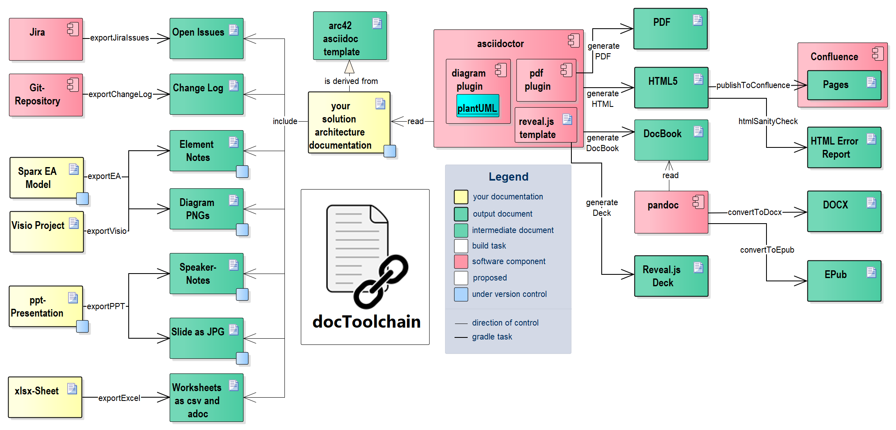

title=looking back at a great 2017
date=2018-01-07
type=post
tags=spock, geb, doc, asciidoc, arc42
status=published
author=rdmueller
~~~~~~

The year is already seven days old, but it is still time to take a quick look back.

2017 was a great year for me regarding my community activity and the progress of my open source project [docToolchain](https://github.com/docToolchain/docToolchain).

This year, I had several chances to talk about Spock & Geb (thanx to [DevOpsWuerzburg](https://twitter.com/DevOpsWuerzburg) for inviting me and [Tobias Kraft](https://twitter.com/tokraft) for giving me the chance to be his co-speaker) and Docs-as-Code plus [docToolchain](https://github.com/docToolchain/docToolchain) (thanx to [JAX](https://twitter.com/jaxcon), the [Software Architecture Summit](https://twitter.com/SoftwArchSummit) and the [JUG Darmstadt](https://twitter.com/JUG_DA) for inviting me and to [Falk Sippach](https://twitter.com/sippsack) for combining our talks!). The slides are all available on [speakerdeck](https://speakerdeck.com/rdmueller).

A special thank you goes out to [Gernot Starke](https://twitter.com/gernotstarke) who helped me to prepare the JAX-Talk and Architecture Summit-Workshop and let me be his co-speaker! Together we also wrote the [Hitchhiker’s Guide to Docs as Code](https://jaxenter.de/tag/hhgdc) as series of articles for the german [Java Magazin](https://entwickler.de/java-magazin).

These where all great experience and I hope I can build on these this year. I already have a slot for a talk about docs-as-code at the [Entwicklertag Frankfurt](https://entwicklertag.de/frankfurt/2018/docs-code-arc42-asciidoc-gradle-co-im-einsatz) and I hope more chances will come up.

The best about all these events where the talks with you - the audience - afterwards and the feedback I could collect. Documentation as a topic seems to be more interesting than I thought and people see that the docs-as-code aproach makes sense. 

This is also reflected by the momentum the [docToolchain](https://github.com/docToolchain/docToolchain) project gained this year. It now has a [full blown manual](https://doctoolchain.github.io/docToolchain/) and more than eight [contributors](https://doctoolchain.github.io/docToolchain/#_acknowledgements_and_contributors) who contributed 2017 more features than I did. So it is now a project which is owned by the community - that's a great feeling! Thanx to all of you!

Through the community contributed features, [docToolchain](https://github.com/docToolchain/docToolchain) gained the ability to export Excel, PPT and Visio. There will soon be a point where I  have to split the architecture diagram into several ones:

Speaking of this diagram - docToolchain even managed to be referenced in the newest edition of [Gernot Starkes](https://twitter.com/gernotstarke) book "[Effektive Softwarearchitekturen](https://www.amazon.de/Effektive-Softwarearchitekturen-Ein-praktischer-Leitfaden/dp/3446452079/ref=dp_ob_title_bk)"!

I nearly forgot to mention that docToolchain was also mentioned by [Simon Brown](https://twitter.com/simonbrown) in one tweet together with [Grady Booch](https://twitter.com/Grady_Booch) - isn't that cool?

<blockquote class="twitter-tweet" data-lang="de">
I did a short interview at <a href="https://twitter.com/VoxxedAthens?ref_src=twsrc%5Etfw">@VoxxedAthens</a> with <a href="https://twitter.com/katharineCodes?ref_src=twsrc%5Etfw">@katharineCodes</a> recently -&gt; <a href="https://t.co/l0mWJ2ioy0">https://t.co/l0mWJ2ioy0</a> … hat tips to <a href="https://twitter.com/Grady_Booch?ref_src=twsrc%5Etfw">@Grady_Booch</a> &amp; <a href="https://twitter.com/docToolchain?ref_src=twsrc%5Etfw">@docToolchain</a>
&mdash; Simon Brown (@simonbrown) <a href="https://twitter.com/simonbrown/status/880812832010448896?ref_src=twsrc%5Etfw">30. Juni 2017</a></blockquote>

(btw: I love the C4 approach invented by [Simon Brown](https://twitter.com/simonbrown) and his books on [Software Architecture for Developers](https://softwarearchitecturefordevelopers.com/))
I am also very happy that the year gave me lots of chances to meet many of those great people from my twitter time line and talk over a pizza or a beer with them. I learned a lot from all of you! 

We are dwarfs standing on the shoulders of giants - in this sense, I would also like to thanx the [Asciidoctor](https://twitter.com/asciidoctor), the [Apache Groovy](https://twitter.com/ApacheGroovy) and [Gradle](https://twitter.com/gradle) project teams who all created the wonderful basis for docToolchain.

Hope to see you all again in 2018!
