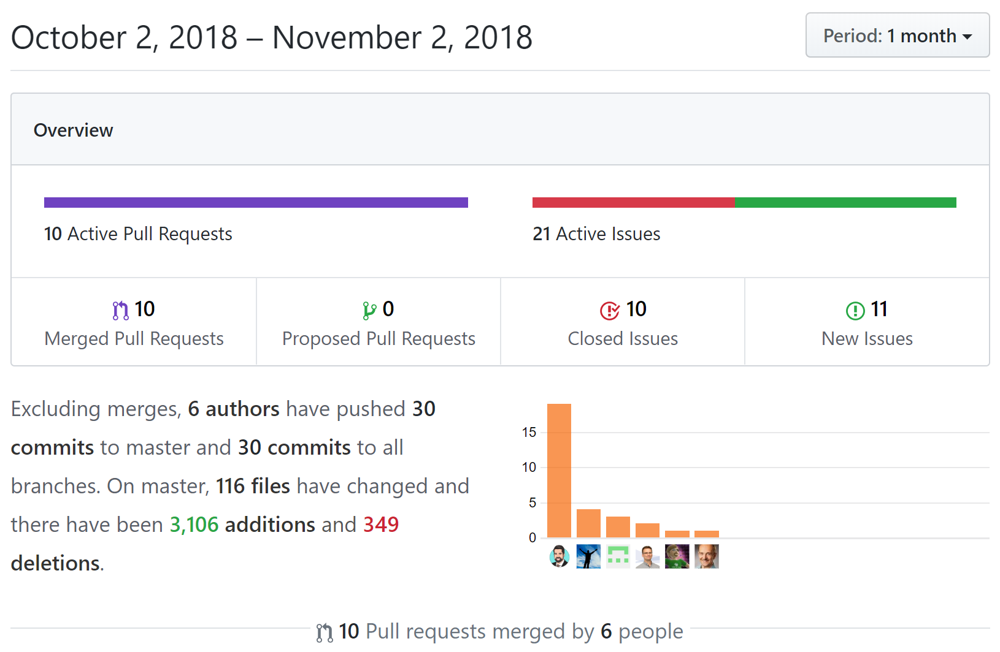

title=The Results are in!
date=2018-11-02
type=post
tags=asciidoc
status=published
author=rdmueller
~~~~~~

[Hacktoberfest](https://hacktoberfest.digitalocean.com) turned October into the most productive month of the last year in regards to [docToolchain](https://docToolchain.github.io/docToolchain):

Not only did we reach my goal of 10 pull requests for [docToolchain](https://docToolchain.github.io/docToolchain), Hacktoberfest also added new features and new contributors to [docToolchain](https://docToolchain.github.io/docToolchain)!!

Regarding my personal experience with this years hacktoberfest, it was quite more intense than last years.
I already participated in last years hacktoberfest and so this time, I didn't expect to learn much from it. 
That was wrong. 

I started out to create 5 PRs, and ended with 26 and with a better understanding of git.

"What was so different to last year?" you may ask...

Well, I noticed that I've got several benefits from Hacktoberfest. 
A PR shouldn't be a big thing - you do it several times a week, don't you? 
No - at least I don't do it. For most projects I work on, I directly commit on branches and merge them. 
I only seldom do PRs, and if I do them, they are trivial.

I did a quick survey on twitter and it turns out that quite a lot of devs in my filter bubble also don't do PRs:

<blockquote class="twitter-tweet" data-lang="de">
on your main project, how do you contribute code?
&mdash; Ralf D. Müller™ (@RalfDMueller) <a href="https://twitter.com/RalfDMueller/status/1056233723753099264?ref_src=twsrc%5Etfw">27. Oktober 2018</a></blockquote>

Also, it is not the same if you do just one PR or a bunch of PRs to the same repository where you have to re-sync your fork, do feature branches and rebases.

Moreover, what you do often turns into a habit...

In addition, contributing to open source is different than closed or inner source. 
One big difference is remote work. Yes. An aspect I wasn't aware of.
With open source, you don't sit together in one room and invite the team to a meeting to discuss a change.
Instead **you study the code and architecture of a system** and then eventually open an issue followed by a PR.
This is all across time zones and countries.
And when your PR gets accepted, it feels very productive.

The part with "you study the code and architecture of a system" is quite important to me.
For most Github repositories, this is the harder part because the available documentation often only tells you how to use the system represented by the code but not how the code works under the hood.

It showed me how important the various kinds of documentation are and that we should start to not only link to the source of the documentation ("improve this doc") but also to the source code of the feature described in the documentation. 
I think this would enable more people to contribute.

<h3>What are your thoughts on the barriers to contribute?</h3>

   

PS: As promised, I donated 5€ for each PR to the [Movember foundation](https://movember.com/) and I doubled the amount to round it up to 100€.

<h3>Thanx for supporting docToolchain and the Movember foundation with your PRs!</h3>

