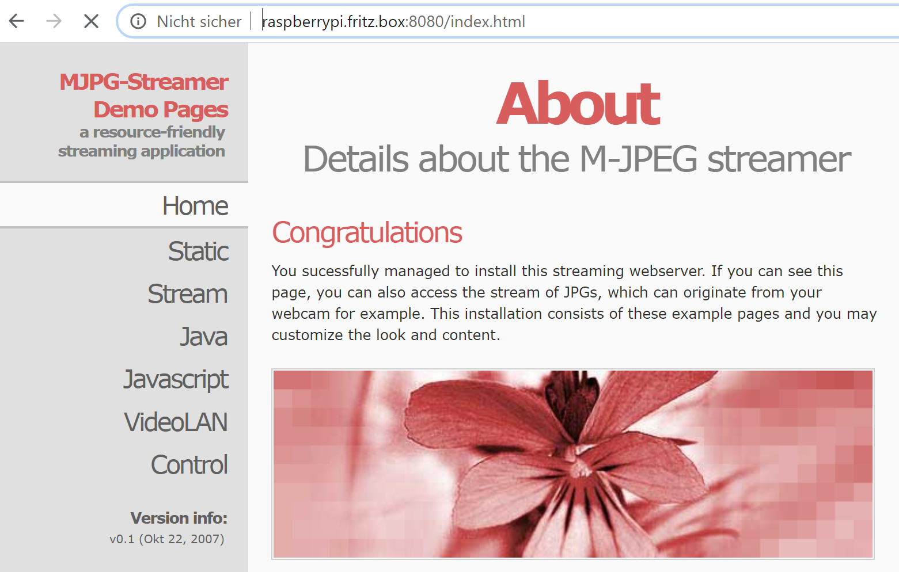

title=Build your own Webcam - Part 2
date=2020-05-16
type=post
tags=corona, recording,vc 
status=published
author=rdmueller
~~~~~~

As promised, I gave some of the tutorials from my last post a try.
Here is what I learned so far.

### Video Source

#### Android

For android based devices, it seems that [IP-Webcam](http://ip-webcam.appspot.com/) is quite a good choice. 
The website looks quite basic but the software itself works great and provides lots of options!
When you start it on your phone, the phone will spin up a webserver which you then can connect to with any other device on your network (make sure that it is only accessible from your trusted network!) 
and it gives you lots of options.

It also comes with a simple driver for this IP based webcam for your PC.

#### Raspberry Pi

Since I had a Raspberry Pi Zero and a camera lying around, I thought it would be fun to turn it into a webcam.
It was quite clear from the start that the Pi Zero does not have too much power but I thought it is ok to give it a try.

To cut the long story short, here is what I learned:

* network connection
  * you can connect the Pi Zero over Wifi or through a usb based network connection (the pi plays the role of a network adapter which only works with the zero or pi 4)
  * the usb connection has less lag and more throughput than the wifi connection
  * the throughput is still the bottleneck for high-quality, high frame-rate video
* [mjpg-streamer](https://github.com/jacksonliam/mjpg-streamer) is a powerful tool to turn your pi into a network camera! It also comes with a cool web interface

* lighting - since I wanted to capture the image of some scribbles on paper with this camera, I wanted to have good illumination. So, I remembered that I have an ultra-bright LED display for the pi zero. These LEDs have a very cold light and I didn't manage to set up the white balance to compensate for that.

Result: it was fun to play around with the Pi, but it is not a solution :-)
 
### Software needed on the PC

#### ManyCam

[ManyCam](https://manycam.com/) seems to be a nice and easy to use solution with many options and effects.
But it also comes with a price tag.
The pricing plan I would go for is the lifetime studio version for which the price is $119. :-o

ManyCam not just provides a virtual cam for IP based sources, it can also bring together a bunch of other sources, present them as picture in picture, lets you switch through scenes and even lets you add a timer or other effects.
So, if you are willing to pay the price, this tools seems to be quite fun!

#### SplitCam

[SplitCam](https://splitcam.com/) does not provide as many features as ManyCam and it also didn't look too trustworthy. 
When I read the first blog post "How to add StripChat Stream", I knew that I am not the target group :-)

I didn't try the other tools mentioned in the tutorials, because I had another idea:

#### OBS Studio

[OBS Studio](https://obsproject.com/) is an open source and free tool which I already use to record my talks.

There is a [virtual camera plugin for OBS](https://obsproject.com/forum/resources/obs-virtualcam.949/) which lets you select the OBS output as webcam input in most video chat solutions.
This allows me to take some input and re-use it as webcam!

I also found out that it supports a VLC video source as input.
This works in such a way that OBS uses the VLC libraries to display a network stream like VLC - VLC itself does not have to be running.
Unfortunately, this turns out to be quite laggy and thus unusable in a live environment.

#### OBS Ninja to the rescue

As reaction to my last post, [Daniel Pisanu](https://twitter.com/d_pisanu) mentioned [obs.ninja](https://obs.ninja) as a solution.
It is really cool, but I needed some help to get it up and running.
This was basically because I didn't understand the solution at first.

The website builds up a video chat connection between any two webRTC capable devices.
As result, you will get a peer-to-peer video stream in your browser.
It works quite like jitsi.

First, I tried to get the room functionality to work and didn't succeed, but if you use the big "Create Reusable Invite" button, it works like a charm.

You can even share your desktop this way.

Since it is browser based, you can add nearly every WiFi connected device as video source. 
Even those cheap Amazon kindle fire tablets!

Now, the next step is to add this stream to your OBS scene.
To do so, add a web-browser as source and point it to your OBS-Ninja link.
As a result, you will get a high quality stream with only a tiny lag within OBS!

And this works for other web based resources too!
It even turns out that you can use the stream URL of your raspberry pi cam to workouround the laggy VLC input.
Or add a nice timer through [timer.digital-wachsen.de](http://timer.digital-wachsen.de/)

So, OBS is the way to go for me now!

### What about the digital cameras?

I also went through my box of old digital cameras and it turned out that none of it had web cam features.

But yesterday I saw that you can get a Canon EOS 2000D for as cheap as 299€ and I read that the Cannon webcam utility should work with that camera.
So, I ordered it and will see....

**Update**: I've got my EOS camera and it works well. You have to learn how to handle it (sometimes it does not recognize the camera because it seems to be blocked from another session or the EOS utility - exit it before you use the EOS as webcam). But the result is a sharp and high quality picture!

## Conclusion

For me as techhie, OBS is the way to go, but it is not a solution for everyone.

[OBS.ninja](https://obs.ninja) is a great solution for remote sources.

Regarding the webcam hardware, I am quite happy with the quality of my logitec C920, but I am also eager to try the Canon EOS as new high quality webcam.
