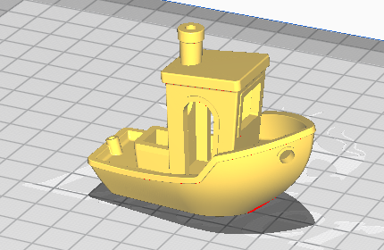

title=3D Druck
date=2021-05-03
type=page
status=draft
~~~~~~

== 3D Druck für interessierte

* Du hast Interesse am 3D Druck aber keinen Zugang zu einem 3D Drucker?
* Du bist Schüler, Student oder Hobby-Bastler?
* Du wohnst in Schwalbach am Taunus oder einem angrenzenden Ort?

Dann könnte folgendes für Dich interessant sein.

Ich biete die Mitbenutzung meines 3D Druckers an.

=== Wie funktioniert das?

Du schickst mir Dein 3D Modell als `.stl` oder `.gcode` file per mailto:ralf.d.mueller@gmail.com[eMail] und nennst mir dabei Deinen Filament-Wunsch.

Sollte mir auffallen, dass es Probleme beim Druck geben wird, melde ich mich.
Ansonsten schicke ich Dir eine zahlungsaufforderung per paypal.
Nach erhalt der Zahlung nehme ich das Modell ohne weitere Bearbeitung und sende es an den Drucker.

Ist der Druck erfolgt, erhältst Du eine eMail, dass der Druck abholbereit ist.

=== Was kostet der Druck?

Diesen Service biete ich privat an, erhebe aber dennoch eine kleine Schutzgebür von 0,50€ pro Druck plus 0,50€ pro angefangene 30 Minuten Druckzeit.

==== Beispiel: Benchy

[.center]

Benchy, der bekannte 3D Druck Benchmark braucht 2 Stunden 44 Minuten zum Drucken.
Das Filament (5,21m) kostet mich ca. 0,45€.

Das Modell hat eine Größe von ca. 60x31x48mm.

Als Preis würde ich 0,50€ Grundkosten + 6*0,50€ für 6 angefangene 30 Minuten, also 3,50€ verlangen.

=== Welcher Drucker wird genutzt?

Es kommt ein Creality Ender 3 mit Glasbett und neuem 16-Bit Mainboard zum Einsatz.
Das ist ein Low-Cost Drucker, der aber ordentliche Ergebnisse liefert.

==== Druckraum

=== Wie kann ich `.gcode` Files erzeugen bzw. slicen?

Den Vorgang ein 3D-Modell (`.stl`) in eine druckbare Datei (`.gcode`) zu wandeln wird als slicen bezeichnet, weil das Modell in Scheibchen zerlegt wird.

Dieser Verarbeitungsschritt ist vom Drucker abhängig, denn der Slicer muss z.B. die Schichtdicke und noch viele weitere Parameter kennen.

Zum Slicen empfehle ich Cura mit dem Standard Creality Ender 3 Profil.

Die Drucktemperatur muss auf 210°C gesetzt werden (_Meterial>Printing Temperature_).

Als Support bei komplexeren Modellen habe ich sehr gute Erfahrung mit _Support Structure > Tree_ gemacht.

=== Was ist, wenn der Druck schiefgeht?

3D-Druck ist keine einfache Angelegenheit und man braucht ein wenig Erfahrung für gute Modelle.

Sollte ein Druck fehlschlagen, weil das Modell ungeeignet ist, werde ich Tipps geben, um das Modell zu verbessern.
Es gibt jedoch keine Erstattung der ohnehin schon günstigen Gebühr.

=== Welche Materialien stehen zur Verfügung?

Ich benutze ausschließlich PLA Filamente von Eolas.
Nach Absprache können nicht vorhandene Farben gekauft werden.

Folgende Farben stehen momentan zur Verfügung:

[cols="2"]
|===
| Grau | Grün
| Weiss |
|===

=== Auf was sollte ich beim erstellen des Modells achten?

CAD Design Tips for 3D Printing

Make-Buch

=== Kann ich alles drucken, was ich will?

Fast.
Ich behalte mir das Recht vor, Aufträge ohne angabe eines Grunds abzulehnen.
Eine Ablehnung kann z.B. erfolgen, wenn Waffenteile gedruckt werden sollen oder der Druck gehen das Urheberrecht verstößt.